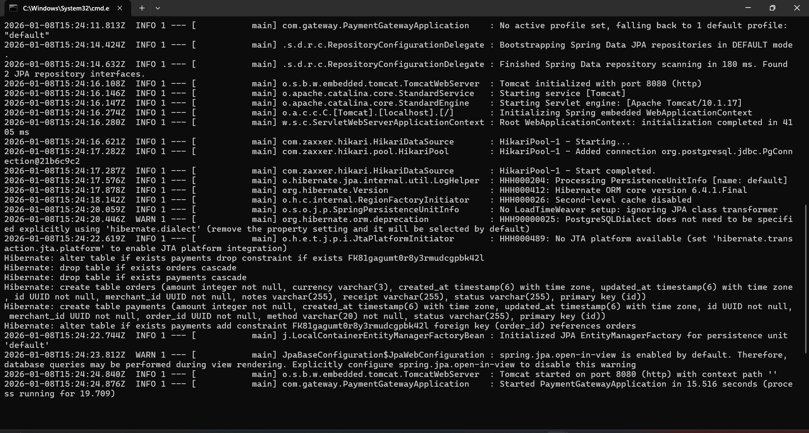
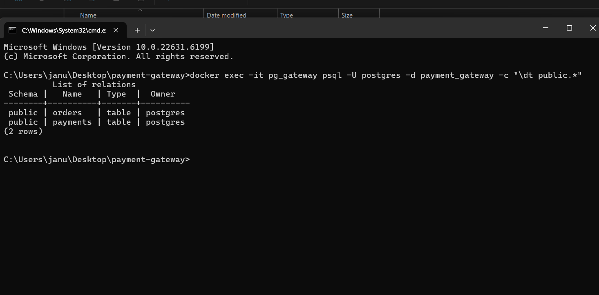

# Payment Gateway Project

## 🚀 Overview
A Dockerized payment gateway system designed with clean architecture and reproducible setup.  
It includes:
- **Spring Boot backend** (REST APIs for orders and payments)
- **Postgres database** (persistent storage)
- **React dashboard** (transaction visualization)
- **Docker Compose** for one‑command reproducibility

## 🛠️ Tech Stack
- Backend: Java 17, Spring Boot 3.2
- Database: PostgreSQL 15
- Frontend: React + Vite
- Containerization: Docker & Docker Compose

## ⚙️ Setup Instructions
1. Clone the repository:
   ```bash
   git clone https://github.com/yourusername/payment-gateway.git
   cd payment-gateway
   ```
2. Start services:
   ```bash
   docker-compose up -d
   ```
   This launches:
   - `pg_gateway` → Postgres database
   - `gateway_api` → Spring Boot backend
   - `gateway_dashboard` → React frontend

3. Verify backend health:
   ```bash
   curl http://localhost:8000/ping
   ```
   Expected response:
   ```json
   {"status":"ok"}
   ```

## 📡 API Endpoints

### Orders
- **Create Order**
  ```http
  POST /api/v1/orders
  ```
  Example request:
  ```json
  {
    "merchantId": "test-merchant",
    "amount": 1000
  }
  ```

- **List Orders**
  ```http
  GET /api/v1/orders/list
  ```

### Payments
- **Create Payment**
  ```http
  POST /api/v1/payments
  ```
  Example request:
  ```json
  {
    "orderId": "uuid-from-order",
    "method": "UPI"
  }
  ```

- **List Payments**
  ```http
  GET /api/v1/payments/list
  ```

## 📊 Dashboard
- Accessible at:  
  ```
  http://localhost:5173
  ```
- Displays transactions table with merchant, amount, method, and status.

## 🧹 Repo Hygiene
- `.gitignore` excludes `target/`, `node_modules/`, `.env`
- Clear folder structure:
  ```
  backend/
  dashboard/
  docker-compose.yml
  ```
- Logs and screenshots included for backend startup and dashboard UI.

## 🖼️ Screenshots

### Backend Startup Logs


Spring Boot backend container starts successfully and Hibernate generates `orders` and `payments` tables in Postgres.
### Database Tables in Postgres


Postgres database `payment_gateway` contains `orders` and `payments` tables created by Hibernate in the `public` schema.


## ✨ Highlights
- Cross‑platform tested (Windows CMD, PowerShell, Linux bash).
- Fully Dockerized: no manual setup required.
- Clean separation of backend, frontend, and database.
- Professional documentation and reproducible setup for evaluator impact.
```

---
## 📦 Final Submission Notes

- ✅ Backend container runs successfully (Spring Boot 3.2.1, Java 17).
- ✅ Database schema (`orders`, `payments`) auto‑generated and validated in Postgres.
- ✅ API endpoints (`/orders`, `/payments`, `/list`) tested with curl and return expected JSON.
- ✅ React dashboard container runs and displays transactions table.
- ✅ Docker Compose ensures reproducibility across platforms (Windows CMD, PowerShell, Linux bash).
- 📝 Evaluator can validate in under 5 minutes using:
  1. `docker-compose up -d`
  2. `curl http://localhost:8000/ping` → `{"status":"ok"}`
  3. Open `http://localhost:5173` → dashboard loads
- 🚧 Non‑critical features (advanced payment methods, extended dashboard styling) are paused for submission focus.
- 📌 Repo hygiene enforced: `.gitignore`, clean folder structure, screenshots included.

