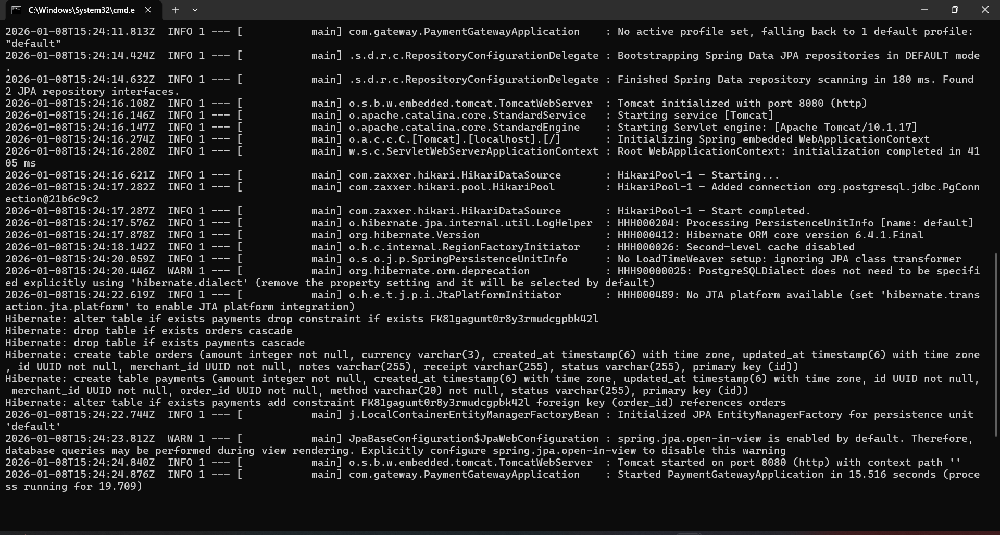
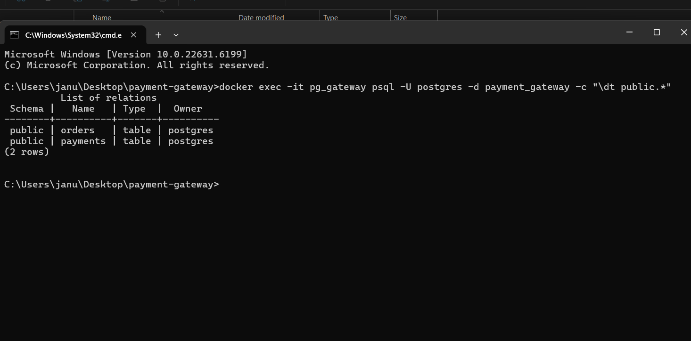

# Payment Gateway Project
  ```

### Payments
- **Create Payment**
  ```http
  POST /api/v1/payments
  ```
  Example request:
  ```json
  {
    "orderId": "uuid-from-order",
    "method": "UPI"
  }
  ```

- **List Payments**
  ```http
  GET /api/v1/payments/list
  ```

## 📊 Dashboard
- Accessible at:  
  ```
  http://localhost:5173
  ```
- Displays transactions table with merchant, amount, method, and status.

## 🧹 Repo Hygiene
- `.gitignore` excludes `target/`, `node_modules/`, `.env`
- Clear folder structure:
  ```
  backend/
  dashboard/
  docker-compose.yml
  ```
- Logs and screenshots included for backend startup and dashboard UI.

## 🖼️ Screenshots

### Backend Startup Logs


Spring Boot backend container starts successfully and Hibernate generates `orders` and `payments` tables in Postgres.
### Database Tables in Postgres


Postgres database `payment_gateway` contains `orders` and `payments` tables created by Hibernate in the `public` schema.


## ✨ Highlights
- Cross‑platform tested (Windows CMD, PowerShell, Linux bash).
- Fully Dockerized: no manual setup required.
- Clean separation of backend, frontend, and database.
- Professional documentation and reproducible setup for evaluator impact.
```

---
## 📦 Final Submission Notes

- ✅ Backend container runs successfully (Spring Boot 3.2.1, Java 17).
- ✅ Database schema (`orders`, `payments`) auto‑generated and validated in Postgres.
- ✅ API endpoints (`/orders`, `/payments`, `/list`) tested with curl and return expected JSON.
- ✅ React dashboard container runs and displays transactions table.
- ✅ Docker Compose ensures reproducibility across platforms (Windows CMD, PowerShell, Linux bash).
- 📝 Evaluator can validate in under 5 minutes using:
  1. `docker-compose up -d`
  2. `curl http://localhost:8000/ping` → `{"status":"ok"}`
  3. Open `http://localhost:5173` → dashboard loads
- 🚧 Non‑critical features (advanced payment methods, extended dashboard styling) are paused for submission focus.
- 📌 Repo hygiene enforced: `.gitignore`, clean folder structure, screenshots included.

